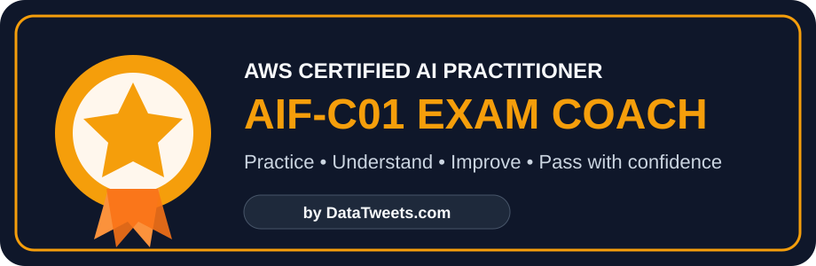

<p align="center">
  
</p>

<h1 align="center">AWS AI Practitioner Exam Coach — AIF-C01 Practice for Claude & ChatGPT</h1>

<p align="center">
  A beginner-friendly, adaptive <strong>AWS Certified AI Practitioner (AIF-C01)</strong> study coach with three full practice exams, concept relationships, weak-area drills, service-comparison practice, and step-by-step explanations.
</p>

<p align="center">
  <a href="https://datatweets.com/">datatweets.com</a> ·
  <a href="#-start-here--3-simple-steps">Start Here</a> ·
  <a href="#-use-it-with-claude-pro">Claude Pro</a> ·
  <a href="#-use-it-with-chatgpt-plus">ChatGPT Plus</a> ·
  <a href="#-download-the-3-practice-exams">Practice Exams</a>
</p>

<p align="center">
  
  
  
  
</p>

> [!IMPORTANT]
> **You do not need Python, coding, Git, or a terminal to use this exam coach.**  
> If you are a student, follow the simple steps below. The technical files at the bottom of this repository are only for maintainers.

---

## What is this?

This repository helps you prepare for the **AWS Certified AI Practitioner AIF-C01 exam** by turning Claude Pro or ChatGPT Plus into a personal exam coach.

Instead of teaching you to memorize `keyword → answer`, the coach teaches you how to think through AWS exam questions:

**question clue → requirement → AWS concept/service → correct answer → why the distractors are wrong**

It can:

- ask AWS AI Practitioner practice questions one at a time,
- use the **three included 65-question practice exams**,
- generate new original AIF-C01 questions,
- explain every answer in plain English,
- detect your weak topics,
- drill confusing AWS services,
- run mock exams,
- practice multiple-choice and multiple-response questions,
- focus on Amazon Bedrock, SageMaker, RAG, Responsible AI, security, governance, agents, MCP, AgentCore, Kiro, Strands, and more.

### Who is it for?

This project is designed for:

- complete AWS AI beginners,
- students preparing for the AIF-C01 exam,
- professionals who want a fast refresher,
- learners who prefer conversational practice instead of reading hundreds of pages,
- instructors who want an AI-assisted AWS AI Practitioner practice workflow.

---

# Start Here — 3 Simple Steps

<table>
<tr>
<td align="center" width="33%"><br><strong>1. Download</strong><br>Download this repository or the Claude Skill ZIP.</td>
<td align="center" width="33%"><br><strong>2. Add to AI</strong><br>Use Claude Pro Skill upload or a ChatGPT Project.</td>
<td align="center" width="33%"><br><strong>3. Practice</strong><br>Ask for a diagnostic, topic drill, or mock exam.</td>
</tr>
</table>

If you only want to start studying, you can ignore `scripts/`, `requirements-dev.txt`, `.github/`, and other developer files.

---

# Download the 3 Practice Exams

Each practice exam contains **65 questions** and is designed for a **90-minute** practice session.

| Practice exam | Questions | Download |
|---|---:|---|
| Practice Exam 1 | 65 | [Open / download Exam 1](practice-exams/AIF-C01-practice-exam-1.pdf) |
| Practice Exam 2 | 65 | [Open / download Exam 2](practice-exams/AIF-C01-practice-exam-2.pdf) |
| Practice Exam 3 | 65 | [Open / download Exam 3](practice-exams/AIF-C01-practice-exam-3.pdf) |

Together, the three files provide **195 AWS AI Practitioner practice questions** covering all five AIF-C01 domains.

> You can study the PDFs normally, or upload them to Claude/ChatGPT and let the coach quiz you from them.

---

# Use It with Claude Pro

Claude supports custom Skills, so this is the easiest setup.

## Step 1 — Download the Skill ZIP

Click **[Download the Claude Skill ZIP](downloads/aws-ai-practitioner-coach.zip)**. No terminal or Python is needed.

## Step 2 — Enable Skills in Claude

In Claude:

1. Open **Settings**.
2. Open **Capabilities**.
3. Turn on **Code execution and file creation**.
4. Go to **Customize → Skills**.

You do **not** need to write or run code yourself. Claude requires this capability internally for Skills.

## Step 3 — Upload the Skill

1. Click **+** in **Customize → Skills**.
2. Choose **Create skill**.
3. Choose **Upload a skill**.
4. Upload the `aws-ai-practitioner-coach.zip` file.
5. Make sure the Skill is switched **on**.

## Step 4 — Add the Practice Exams

For the best experience, create a Claude Project called:

`AWS AIF-C01 Study`

Upload these three files from the `practice-exams/` folder:

- `AIF-C01-practice-exam-1.pdf`
- `AIF-C01-practice-exam-2.pdf`
- `AIF-C01-practice-exam-3.pdf`

## Step 5 — Start Studying

Try this first:

```text
Use my AWS AI Practitioner Coach skill.
Start a 10-question diagnostic.
Ask one question at a time and track my weak topics.
```

Or practice directly from a PDF:

```text
Use Practice Exam 1.
Ask me question 1, but do not show the answer until I respond.
```

For more prompts, see [Practice ideas](#-practice-ideas-for-students).

---

# Use It with ChatGPT Plus

For personal ChatGPT Plus accounts, use a **Project**. Projects keep your instructions, files, and study chats together.

## Step 1 — Create a Project

1. Open ChatGPT.
2. Click **New project** in the sidebar.
3. Name it:

`AWS AIF-C01 Coach`

## Step 2 — Add the Coach Instructions

Open:

[`CHATGPT_PLUS_PROJECT_INSTRUCTIONS.md`](CHATGPT_PLUS_PROJECT_INSTRUCTIONS.md)

Copy all of the text into your ChatGPT Project instructions.

## Step 3 — Upload the Knowledge Files

Upload these files from `references/`:

- `official-blueprint-summary.md`
- `aif-c01-taxonomy.yaml`
- `taxonomy/d1.yaml`
- `taxonomy/d2.yaml`
- `taxonomy/d3.yaml`
- `taxonomy/d4.yaml`
- `taxonomy/d5.yaml`
- `relationship-graph.csv`
- `decision-rules.yaml`
- `question-blueprints.yaml`

## Step 4 — Upload the Practice Exams

Upload:

- `practice-exams/AIF-C01-practice-exam-1.pdf`
- `practice-exams/AIF-C01-practice-exam-2.pdf`
- `practice-exams/AIF-C01-practice-exam-3.pdf`

ChatGPT Plus currently supports enough Project files for this complete setup.

## Step 5 — Start Studying

```text
Start AWS AI Practitioner diagnostic mode.
Give me 10 questions one at a time.
After I answer, explain the correct answer and every distractor.
Track my weak topics.
```

Or:

```text
Use Practice Exam 2.
Quiz me from the PDF in random order.
Do not reveal an answer before I respond.
```

---

# How the Exam Coach Helps You Learn

The coach uses a taxonomy and relationship graph so it can recognize what a question is **really testing**.

For example:

| If the question says... | Think about... |
|---|---|
| Current/private information without retraining | RAG / Knowledge Bases for Amazon Bedrock |
| Labeled examples to teach a task or output style | Fine-tuning |
| Large unlabeled domain corpus | Continued pre-training |
| Smaller, faster, cheaper model that keeps teacher behavior | Model distillation |
| API activity and who did what | AWS CloudTrail |
| Resource configuration and compliance state | AWS Config |
| Collect audit evidence | AWS Audit Manager |
| Best-practice recommendations | AWS Trusted Advisor |

This is why the coach is more useful than simple answer memorization.

---

# 🎯 Practice Ideas for Students

### Beginner diagnostic

```text
I am a beginner.
Give me 15 mixed AIF-C01 questions one at a time.
Use simple explanations after each answer.
```

### Weak-area practice

```text
Review my mistakes and give me new questions only on my weak concepts.
```

### AWS service-selection practice

```text
Give me scenario questions where I must choose the correct AWS AI or ML service.
```

### Bedrock practice

```text
Drill me on Amazon Bedrock, Knowledge Bases, Guardrails, Agents, RAG, and model customization.
```

### Confusing concepts

```text
Give me difficult comparison questions on RAG vs fine-tuning vs continued pre-training vs distillation.
```

### Governance practice

```text
Drill CloudTrail vs AWS Config vs Audit Manager vs Trusted Advisor until I stop confusing them.
```

### Mock exam

```text
Run a 65-question AIF-C01-style mock exam.
Do not give explanations until the end.
```

### Practice from the included PDFs

```text
Use Practice Exam 3.
Ask questions one at a time in random order.
Track which questions I get wrong.
```

---

# AIF-C01 Topics Covered

The coach follows the current AWS Certified AI Practitioner blueprint and covers the five major areas:

1. **Fundamentals of AI and ML**
2. **Fundamentals of Generative AI**
3. **Applications of Foundation Models**
4. **Guidelines for Responsible AI**
5. **Security, Compliance, and Governance for AI Solutions**

Important concepts include:

- artificial intelligence, machine learning, deep learning,
- supervised, unsupervised, semi-supervised, and reinforcement learning,
- foundation models and large language models,
- transformers, embeddings, tokens, and diffusion models,
- Amazon Bedrock and Amazon SageMaker,
- RAG, fine-tuning, continued pre-training, and model distillation,
- prompt engineering and context engineering,
- agents, tools, MCP, AgentCore, Kiro, and Strands Agents,
- responsible AI, bias, explainability, hallucination, and toxicity,
- Guardrails for Amazon Bedrock,
- AWS IAM, CloudTrail, Config, Audit Manager, Trusted Advisor, Macie, and security concepts.

---

# Beginner FAQ

### Do I need Python?

**No.** Students do not need Python at all.

### Do I need to install anything?

No local software is required if you are using Claude or ChatGPT in the browser.

### Do I need AWS experience?

No. The coach can start at beginner level and increase the difficulty as you improve.

### Are the three practice exams included?

Yes. They are available in the [`practice-exams/`](practice-exams/) folder.

### Can the AI explain why my answer is wrong?

Yes. That is one of the main purposes of the coach. It explains the decisive clue, the correct answer, and why the distractors do not fit.

### Can I focus on only one exam domain?

Yes. For example:

```text
Give me only Domain 3 questions until I reach strong mastery.
```

### Is this an official AWS product?

No. This is an independent educational project for AWS AI Practitioner exam preparation.

---

# Learn More with DataTweets

This project is created as part of the learning resources from **[DataTweets.com](https://datatweets.com/)**.

Visit DataTweets for practical tutorials, courses, and learning material across:

- Artificial Intelligence and Generative AI
- Data Science
- Data Engineering
- Machine Learning
- Cloud and AWS
- Analytics
- SQL, Python, dbt, Terraform, and modern data tools

 **[Visit DATATWEETS](https://datatweets.com/)**

---

# 🔎 AWS AI Practitioner Exam Prep Keywords

This repository is designed to help learners looking for:

**AWS AI Practitioner practice exam**, **AIF-C01 practice questions**, **AWS Certified AI Practitioner study guide**, **AWS AI Practitioner mock exam**, **AWS AI Practitioner exam questions**, **Amazon Bedrock exam practice**, **AWS generative AI certification practice**, **Claude AWS exam skill**, **ChatGPT AWS AI Practitioner coach**, and **AIF-C01 exam preparation for beginners**.

---

# For Maintainers and Contributors Only

> Students can stop reading here. Everything below is optional developer tooling.

The repository includes small Python utilities for maintaining the Skill package. They are **not required for studying**.

The scripts are used to:

- validate the Skill structure,
- check taxonomy/reference files,
- package the Claude Skill ZIP.

Maintainer commands:

```bash
python -m pip install -r requirements-dev.txt
python scripts/validate_skill.py .
python scripts/package_skill.py
```

GitHub Actions also validates the repository automatically after changes.

---

## Repository Structure

```text
aws-ai-practitioner-coach/
├── README.md                         # Start here
├── SKILL.md                          # Claude Skill behavior
├── CLAUDE_PRO_QUICK_SETUP.md         # Short Claude guide
├── CHATGPT_PLUS_PROJECT_INSTRUCTIONS.md
├── assets/                           # Beginner-friendly SVG graphics
├── downloads/                        # Ready-to-upload Claude Skill ZIP
├── practice-exams/                   # 3 × 65-question practice PDFs
├── references/                       # AIF-C01 taxonomy and reasoning rules
├── templates/                        # Optional learning-state templates
├── scripts/                          # Maintainer-only utilities
└── .github/                          # Automated validation
```

---

## About the Practice Material

The repository includes three practice exam PDFs supplied for this educational project. Each includes questions, an answer key, and explanations. The coach can use them as source material when a learner explicitly asks to practice from them.

Generated questions should be clearly treated as **original practice questions**, not as official AWS certification exam questions.

---

## Disclaimer

This is an independent educational resource and is **not affiliated with or endorsed by Amazon Web Services (AWS)**. AWS, Amazon Bedrock, Amazon SageMaker, and related names are trademarks of Amazon.com, Inc. or its affiliates.

The certificate-style graphic used in this repository is an original project graphic, not an official AWS certification badge.
